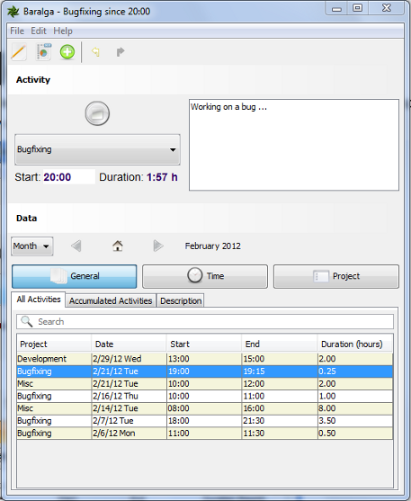

[](https://github.com/Baralga/baralga/actions) [](https://sonarcloud.io/dashboard?id=baralga) [](https://snyk.io/test/github/baralga/baralga) [](https://sourcespy.com/github/baralgabaralga/)  


Baralga Time Tracker
====================
Simple and lightweight time tracking. 



Record the time spent on a project or manually enter and edit activities.

### Features
* plain time tracking no fuzz
* switch projects with tray icon
* record your activities
* report as Excel, CSV and iCalendar
* manually add and edit activities
* enter data fast with shortcuts
* suitable for single users and teams

### Editions
Use [Baralga](https://baralga.github.io/) just for yourself or for your whole team.

#### Single User Mode
As a single user use our great [Desktop application](https://github.com/Baralga/baralga/releases).

#### Multi User Mode
As a team use our great [Desktop application](https://github.com/Baralga/baralga/releases) along with our [team server](https://github.com/Baralga/baralga-app).

# User Guide

### Single User Mode
Single user mode is enabled by default so no extra settings required.

## Multi User Mode
In multi-user mode all data is stored on the Baralga server backend. Multi-user mode is enabled using the Java system property
`-DuserMode=multiuser` or the setting `userMode=multiuser` in the `application.properties`
stored in the directory `$USER_HOME\.baralga\application.properties`.

### Settings in Application Properties

```properties
# Mandatory for multiuser mode
userMode=multiuser

# Default value http://localhost:8080
backendURL=http://localhost:8080

# Default value is current system user
user=user

# Default value us3r
password=us3r
```

# Changelog

see [Changelog](CHANGELOG.md)
